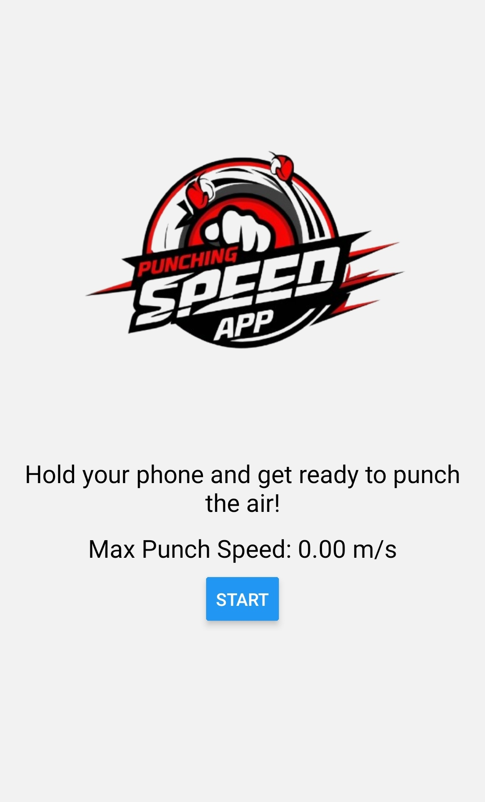
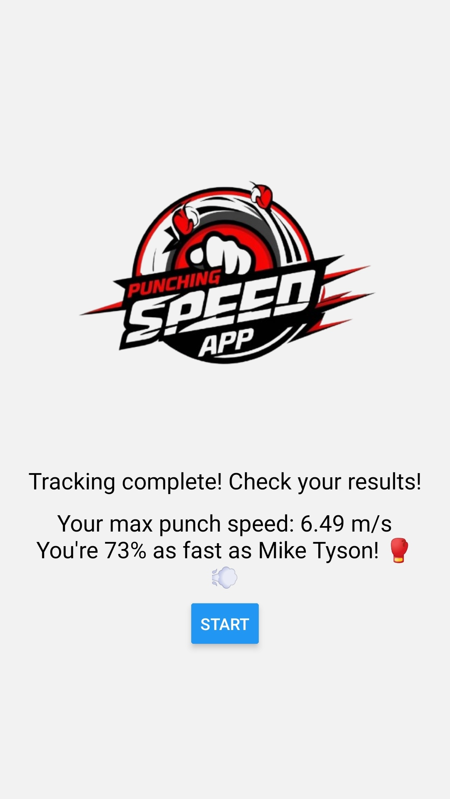

# Punching Speed App - Shadow Boxing

## Overview

"Punching Speed App" is an interactive mobile application that measures the speed of your punch using the phone's accelerometer. By tracking your punch speed, the app provides users with feedback on their performance, comparing it to the punching power of legendary boxers like Mike Tyson. This app offers an engaging and fun way to track and improve your punch speed while offering a lighthearted comparison to world-class athletes.

## Portfolio Project

This app was developed as a personal portfolio project to showcase skills in building interactive mobile applications using React Native and Expo. The app demonstrates real-time sensor data handling with the phone’s accelerometer and provides users with an entertaining way to measure their physical performance.

## Features

- **Punch Speed Tracking**: Measure the speed of your punch in meters per second (m/s) using your phone's accelerometer.
- **Live Feedback**: Receive real-time feedback on your maximum punch speed during each attempt.
- **Comparison to Mike Tyson's Punch Speed**: After each attempt, compare your speed to the legendary punch of Mike Tyson.
- **Simple User Interface**: Enjoy an easy-to-navigate interface that gives clear instructions and displays results in a user-friendly manner.
- **Instructional Flow**: Follow clear steps to perform the perfect shadow punch, with a 2-3 second countdown before measuring the speed.
- **Real-Time Results**: After each attempt, get an instant result showing your maximum punch speed, followed by a fun comparison to Mike Tyson's punch speed.

## Technology Stack

- **React Native**: Used to build the mobile app for both iOS and Android platforms.
- **Expo**: A framework to speed up the development and deployment of the app.
- **Expo-Sensors**: Utilized for capturing real-time accelerometer data from the phone.
- **JavaScript/TypeScript**: Programming languages used for app development.

## Usage

To run the app on your phone, follow these steps:

1. **Clone the repository**:

   - Clone the repository from GitHub to your local machine using:
     ```bash
     git clone git@github.com:Costea47/PunchingSpeedApp.git
     ```

2. **Install dependencies**:

   - Open a terminal and navigate to the project directory:
     ```bash
     cd punch-speed-app
     ```
   - Install the required dependencies by running:
     ```bash
     npm install
     ```

3. **Start the development server**:

   - Start the Expo development server by running:
     ```bash
     npm start
     ```

4. **Run the app on your phone**:
   - Download the **Expo Go** app from the App Store (iOS) or Google Play Store (Android).
   - Open the Expo Go app on your phone.
   - Scan the QR code that appears in the terminal or on the web page.
   - The app will open on your phone, and you can start using it to track your punch speed.

### Example of the application in use:




## License

This project is licensed under the MIT License. See the [LICENSE](LICENSE) file for more details.

## Acknowledgements

- Special thanks to the Expo and React Native teams for their frameworks and tools.
- Inspired by the legendary boxer Mike Tyson, whose punch speed served as the benchmark for this app.
- This app is designed as a fun and educational tool to inspire fitness and self-improvement.
